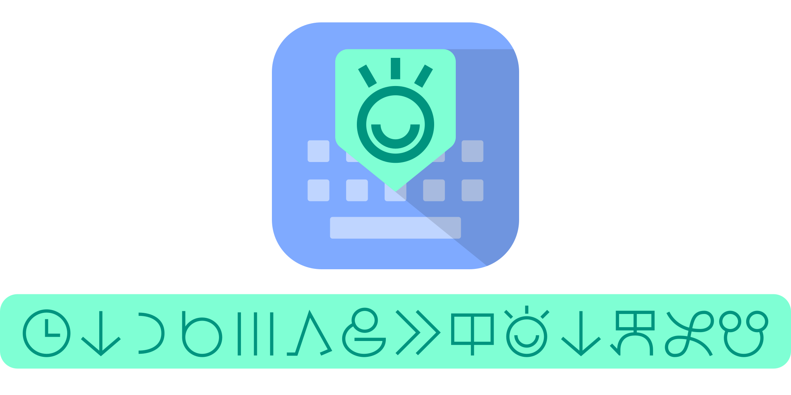
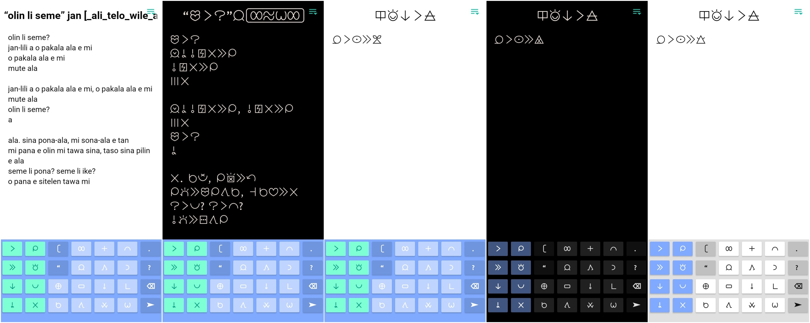
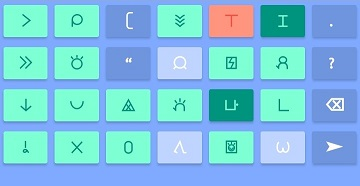
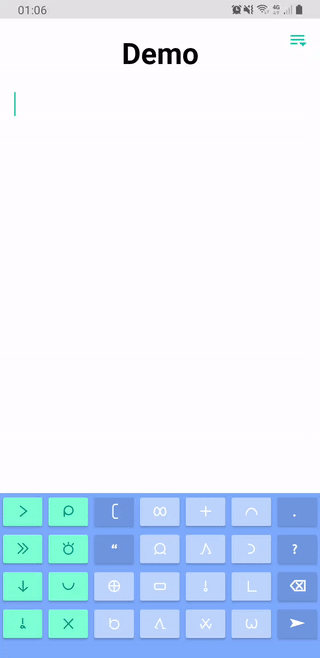
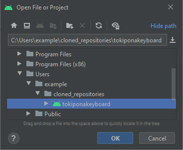
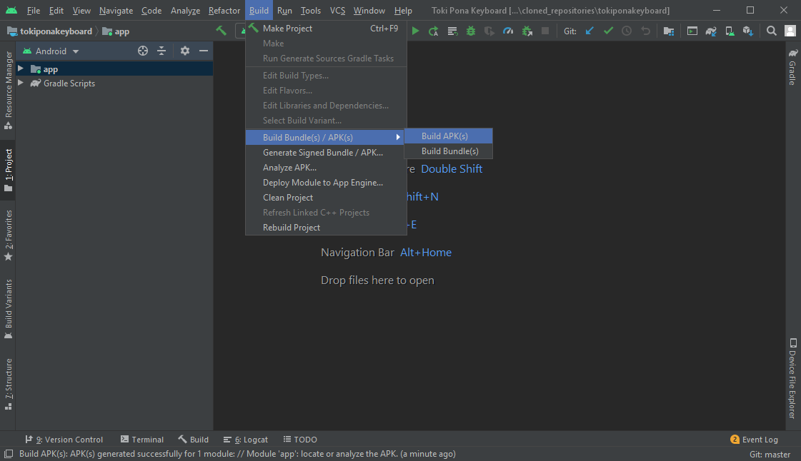

#### Table of contents

 + [What is Toki Pona Keyboard?](#what-is-toki-pona-keyboard)
 + [How I made it](#how-i-made-it)
 + [The layout](#the-layout)
   + [Simple glyphs](#simple-glyphs)
   + [Compound glyphs](#compound-glyphs)
   + [Special behavior](#special-behavior)
 + [Installation](#installation)
   + [Download precompiled version](#download-precompiled-version)
   + [Build from source](#build-from-source)
 + [Help improve this project](#help-improve-this-project)
 + [Support me](#support-me)


<a name="what-is-toki-pona-keyboard"/>

## What is Toki Pona Keyboard?

Toki Pona Keyboard is an android application that adds an input method specifically for writing in Sonja Lang's [toki pona](https://tokipona.org/) language. The keyboard uses the hieroglyphic writing system called [sitelen pona](http://tokipona.net/tp/janpije/hieroglyphs.php). This means that the users enter entire words rather than typing one letter at a time.





<a name="how-i-made-it"/>

## How I made it

This keyboard was built using the [standard android libraries](https://developer.android.com/). It types plain text and therefore it can be used anywhere to type in toki pona. The keys themselves also contain simple text but are styled into hieroglyphics with the [linja pona 4.2](http://musilili.net/linja-pona/) font. This font is also active on some of the screenshots, but the way the words are rendered is completely dependent on the app that the text is on.


<a name="the-layout"/>

## The layout

The chosen words for each keys is heavily influenced by [this](https://gist.github.com/increpare/9aaf57056b857cb44a38d0ff0de9534b) data on word frequency in toki pona that was compiled together by [Stephen Lavelle](https://www.increpare.com/). He analyzed data from \#toki-pona-taso on the ma pona pi toki pona discord server.


<a name="simple glyphs"/>

### Simple glyphs

The keyboard is made up of three sections:

 

 Word keys - These are the 8 most commonly used words. These keys simply type out the corresponding words.

 Special keys - These all have a tap and long press function. Which is how you can achieve **,** **:** and **!** by long pressing **[** **.** and **?** respectively. 

 Letter keys - These have both a word and letter associated to them. The word is the one displayed on the key, and the corresponding first letter of that word. When a letter key is pressed, nothing is typed and the view of the keyboard changes. For example, if you tap _pi_ you are presented with this:

 

Here, you are presented with more word keys that will simply type the word, as well as:

 Unofficial (non pu) words - which are essentially word keys.

 Unfinished words - These act like letter keys and will change to a new view.

Basic rules of the layout:

+ Any non word key will type the word that is displayed on it if it is tapped twice.
+ The first key to press to find a word is always its first letter.
+ All shortcuts are made from letters that belong to that word.


<a name="compound-glypths"/>

### Compound glyphs

The linja pona 4.2 font uses OpenType features to dynamically compose compound glyphs. This means that you can create compound glyphs from any two words. To create a compound glyph you simply need to slide from one glyph to the next:

 


<a name="special-behavior"/>

### Special behavior

Some keys have their own special behaviors:

+ The **“** (open) key will automatically change to a **”** (close). For most applications this is desirable, but in the rare case you might have nested quotes, you can simply long press the **”** (close) to force a **“** (open) to be typed.
+ Long pressing the **➤** key will open the _"select input method"_ dialog, which allows you to quickly switch to a different keyboard such as Gboard.
+ Long pressing a key essentially acts as a slide onto itself, this is useful in some rare cases. For example: typing _jan-jaki_ requires you to start your slide on _jan_ and to finish on _jan_ to change to the _j_ view where you can find _jaki_.


<a name="installation"/>

## Installation

<a name="download-precompiled-version"/>

### Download precompiled version

This app is in development and only in the Alpha Testing phases. You cannot search for this app on the Play Store yet but you can become an Alpha Tester to gain access to it by [joining the Alpha Testing group](https://groups.google.com/forum/#!forum/toki-pona-keyboard-alpha-testing/join) and then getting the app from here:

<a href='https://play.google.com/apps/testing/uk.co.cocosquid.tokiponakeyboard'></a>

Alternatively, I also upload the APK for each version on the [releases](https://github.com/timeopochin/tokiponakeyboard/releases) page.


<a name="build-from-source"/>

### Build from source

To build this project from source you need an up to date [Android Studio](https://developer.android.com/studio).

Clone the repository:

```sh
git clone https://github.com/timeopochin/tokiponakeyboard.git
```

Open the project with android studio:

 

 

Wait for Gradle to finish syncing then go to _Build_ **>** _Build Bundle(s) / APK(s)_ **>** _Build APK(s)_



Done! You now have an APK in: _<path to cloned repository\>/tokiponakeyboard/app/build/outputs/apk/debug_

If you want to sign your APK you can learn more [here](https://developer.android.com/studio/publish/app-signing).


<a name="help-improve-this-project"/>

## Help improve this project

By becoming an Alpha Tester you will immediately start helping improve this project. Bring up any issues, bugs or suggestions [here](https://github.com/timeopochin/tokiponakeyboard/issues).

Also, feel free to suggest changes to the code if you have any experience in developing for android. This is my first ever app and I imagine I have lots to learn.


<a name="support-me"/>

## Support me

Toki Pona Keyboard is completely free and open source under the [GNU General Public License](https://www.gnu.org/licenses/gpl-3.0.txt), it was made out of love for the language and the desire for an elegant and efficient way to write it. However both time and money has gone into this project, namely paying the registration fee to get the app on the Play Store, so if you would like to donate to support this project's development, that would be hugely appreciated!

If you wish to donate you can do so with PayPal:

<a href='https://www.paypal.com/cgi-bin/webscr?cmd=_s-xclick&hosted_button_id=C7MXW6VTQGBNU&source=url'></a>
